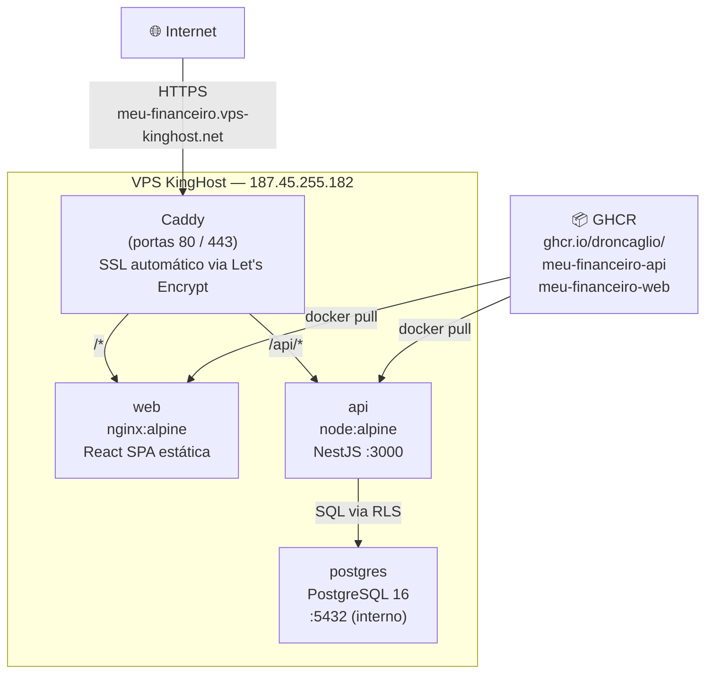
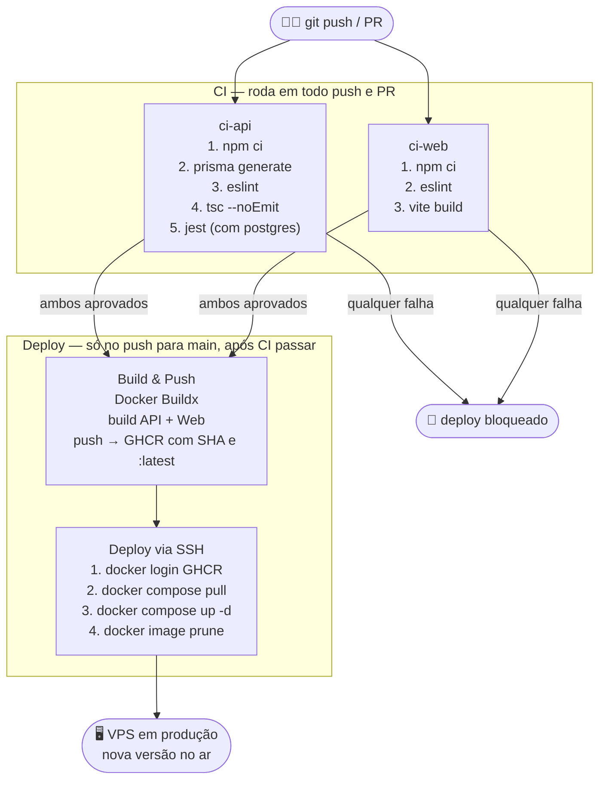
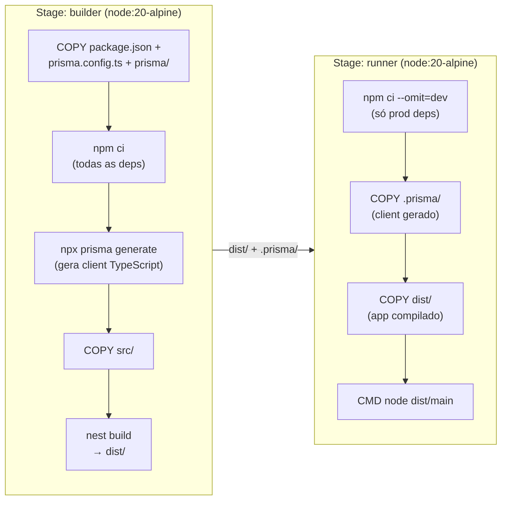
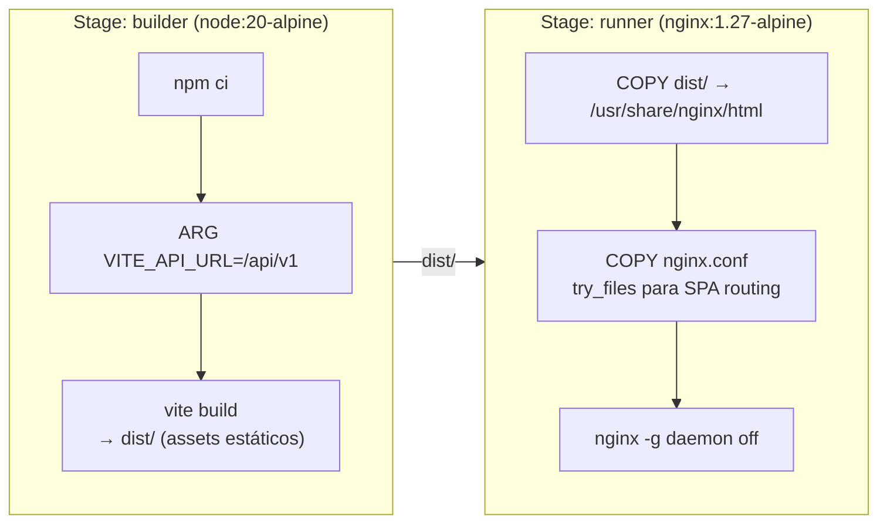
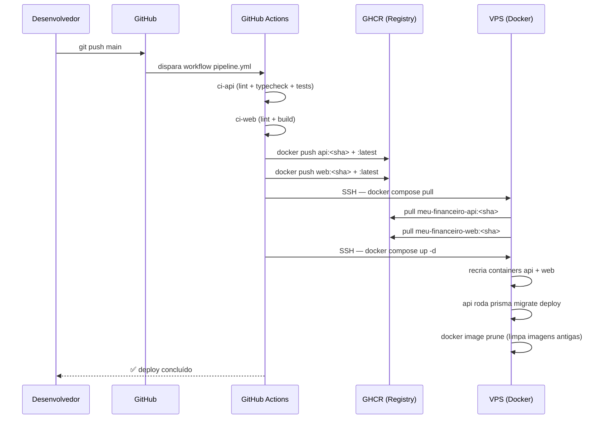

# CI/CD — Meu Financeiro

Documentação completa do pipeline de integração e entrega contínua.

---

## Stack de infraestrutura

| Camada | Tecnologia | Função |
|---|---|---|
| Controle de versão | GitHub | Repositório + gatilho do pipeline |
| CI/CD | GitHub Actions | Lint, testes, build e deploy automatizados |
| Registry de imagens | GitHub Container Registry (GHCR) | Armazena as imagens Docker geradas |
| Contêineres | Docker + Docker Compose | Empacotamento e orquestração dos serviços |
| Reverse proxy / SSL | Caddy | Roteamento HTTP/HTTPS com certificado automático via Let's Encrypt |
| Servidor | VPS KingHost (4 GB RAM, 2 vCPU, Ubuntu 24.04) | Hospedagem de produção |
| Banco de dados | PostgreSQL 16 | Persistência dos dados |

---

## Arquitetura de produção



### Roteamento do Caddy

| Caminho | Destino | Exemplo |
|---|---|---|
| `/api/v1/*` | NestJS (porta 3000) | `GET /api/v1/health` |
| `/api/docs` | Swagger UI (NestJS) | `GET /api/docs` |
| `/*` | nginx servindo React | `GET /` |

---

## Pipeline CI/CD



### Jobs do pipeline

#### `ci-api`
Roda com um serviço PostgreSQL efêmero (`postgres:16-alpine`) para que os testes de integração tenham banco real disponível.

```
actions/checkout
actions/setup-node (Node 20, cache npm)
npm ci
npx prisma generate       ← gera o client antes do lint (tipos necessários para ESLint)
npm run lint              ← ESLint com auto-fix
npx tsc --noEmit          ← typecheck sem emitir arquivos
npm test                  ← Jest com DATABASE_URL apontando para o postgres efêmero
```

#### `ci-web`
```
actions/checkout
actions/setup-node (Node 20, cache npm)
npm ci
npm run lint              ← ESLint
npm run build             ← tsc -b && vite build (valida que o bundle compila)
```

#### `deploy` (somente `push` na `main`, após CI)
```
docker/login-action       ← autentica no GHCR com GITHUB_TOKEN (automático)
docker/setup-buildx       ← habilita BuildKit com cache GHA
docker/build-push-action  ← build multi-stage API + push com tags :latest e :<sha>
docker/build-push-action  ← build multi-stage Web + push com tags :latest e :<sha>
appleboy/ssh-action       ← SSH no VPS, pull das imagens novas, docker compose up
```

---

## Imagens Docker

### API — build multi-stage



**Por que dois stages?**
O stage `builder` tem o compilador TypeScript, `@nestjs/cli`, Jest e todas as devDependencies. O stage `runner` carrega apenas as dependências de produção (~70% menor).

**Observação sobre `prisma.config.ts`:**
O arquivo fica na raiz do projeto (fora de `src/`). Se incluído na compilação, o TypeScript muda o `rootDir` implícito e o output passa para `dist/src/main.js` em vez de `dist/main.js`. Por isso ele é excluído em `tsconfig.build.json` — o Prisma CLI o lê diretamente, sem compilação.

### Web — build multi-stage



**`VITE_API_URL=/api/v1`:**
Como Caddy serve web e API no mesmo domínio, a URL da API é relativa (`/api/v1`). O Axios resolve contra a origem atual — nenhum domínio hardcoded na imagem.

---

## Fluxo de deploy completo



---

## Secrets necessários no GitHub

`Settings → Secrets and variables → Actions`

| Secret | Valor | Uso |
|---|---|---|
| `VPS_HOST` | IP do servidor | Endereço SSH |
| `VPS_USER` | `deploy` | Usuário SSH sem privilégios de root |
| `VPS_SSH_KEY` | Chave privada Ed25519 completa | Autenticação SSH do Actions no VPS |
| `GHCR_TOKEN` | GitHub PAT com `read:packages` | Login no GHCR dentro do VPS para `docker pull` |
| `GITHUB_TOKEN` | Automático (não precisa criar) | Login no GHCR para `docker push` no Actions |

---

## Estrutura de arquivos

```
meu-financeiro/
├── .github/
│   └── workflows/
│       └── pipeline.yml        # CI + CD (lint, tests, build, deploy)
│
├── api/
│   ├── Dockerfile              # Multi-stage: builder + runner
│   ├── .dockerignore
│   └── tsconfig.build.json     # Exclui prisma.config.ts da compilação
│
├── web/
│   ├── Dockerfile              # Multi-stage: builder + nginx
│   ├── nginx.conf              # SPA routing + cache de assets
│   ├── .dockerignore
│   └── tsconfig.app.json       # ignoreDeprecations para baseUrl
│
├── docker-compose.yml          # Dev local: só PostgreSQL + Adminer
├── docker-compose.prod.yml     # Produção: Caddy + API + Web + Postgres
└── Caddyfile                   # Reverse proxy: /api/* → NestJS, /* → React
```

---

## Variáveis de ambiente em produção

Arquivo `/home/deploy/meu-financeiro/.env` no VPS (nunca commitado):

```env
# PostgreSQL
POSTGRES_DB=meu_financeiro
POSTGRES_USER=mfuser
POSTGRES_PASSWORD=<senha forte>

# API — host "postgres" = nome do serviço no docker-compose
DATABASE_URL="postgresql://mfuser:<senha>@postgres:5432/meu_financeiro"

# Segredos JWT e pepper — gerados com crypto.randomBytes(64)
JWT_SECRET=<64 bytes hex>
JWT_REFRESH_SECRET=<64 bytes hex>
APP_PEPPER=<64 bytes hex>

PORT=3000
NODE_ENV=production
```
